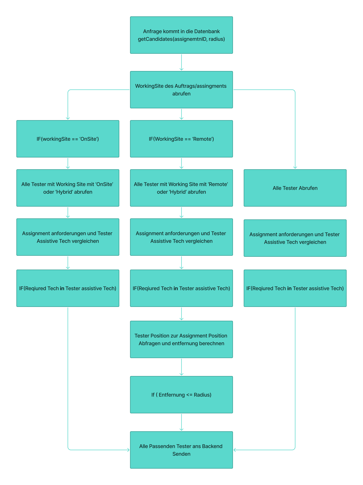
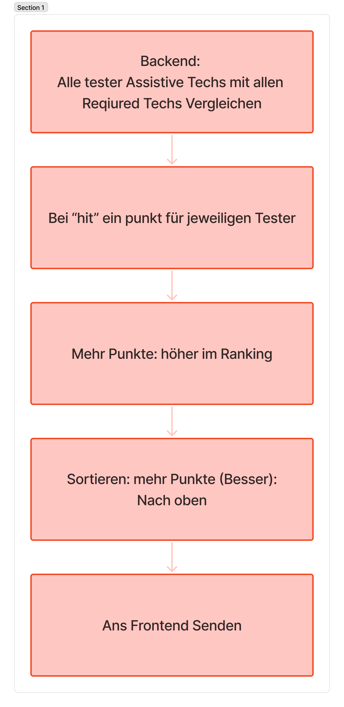
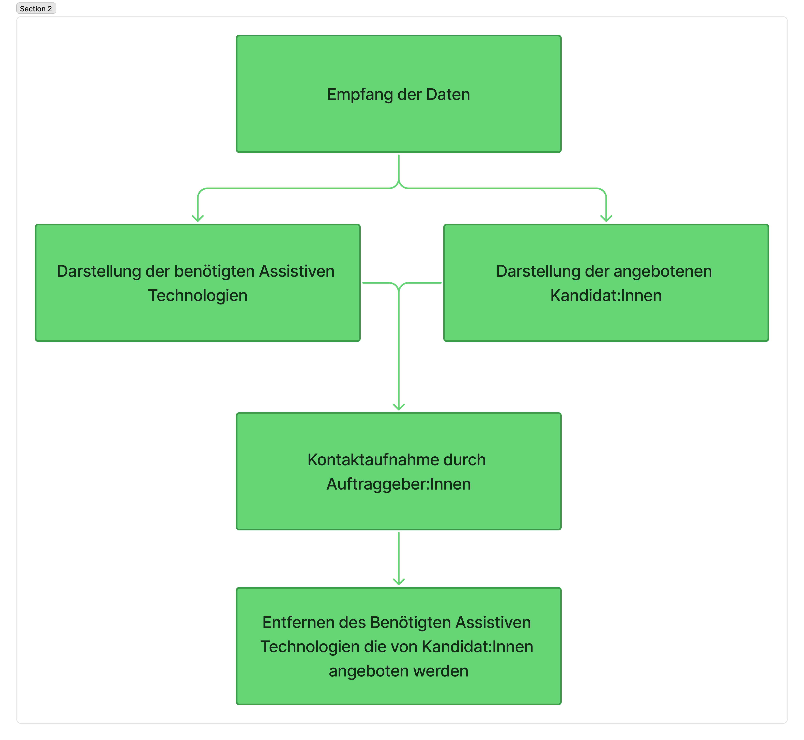

# Bachelorprojekt

Das ist eine Repo für die Bachelorarbeit von Abdurrahman Karakan.

## Setup

Eine kleine Anleitung zum Starten der Anwendungen.

### Datenabnk

Zum Starten des Projektes wird eine Instanz von MySQL benötigt.
Um die vorzubereiten müssen die Dateien aus /Datenbank ausgeführt werden.
Dazu werden die Dateien in der folgenden Reihenfolge ausgeführt:

1. DatenbankModel(Create).sql
2. getCandidates.sql
3. testdaten.sql

Ein User für das Backend muss dazu noch angelegt werden.
Die daten dafür sind:

- host: "localhost"
- user: "Node_app"
- password: "TestPass123"
- database: "mydb"

Die User wurden in das System hardcoded. Eine .env Datei existiert zurzeit nicht.

### Backend

Das Backend ist JS oder NodeJS geschrieben und in der package.json sind alle nötigen Pakete angegeben. Mit "npm install" sollten alle Pakete installiert werden.

In dem Ordner *"/Backend"* `npm install` ausführen.

Mit `npm start` wird das Backend gestartet.

### Frontend

Das Projekt hat seinen Namen beim Erstellen des Frontendes zu *"ConnectAbility"* gewechselt.
Auch hier müssen externe Pakete vorher installiert werden.

In dem Ordner *"/Frontend/ConnectAbility"* `npm install` ausführen, und danach `npm run dev`, da das Projekt nur mit diesen Parametern getestet wurde.

## Bildiche Darstellung des Suchalgorithmuses

Eine genauere textuelle Beschreibung finden Sie in der Bachelorarbeit.

### Datenbank

Die folgenden Schritte werden in der Datenbank ausgeführt.

### Backend

### Forntend

